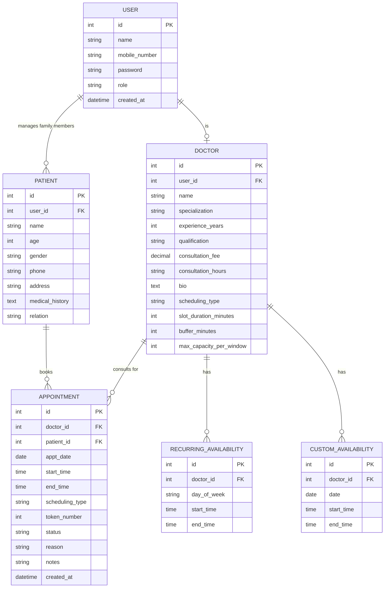

# Schedula ER Diagram

```mermaid
erDiagram
    USER ||--o{ PATIENT : "manages family members"
    USER ||--o| DOCTOR : "is"
    DOCTOR ||--o{ APPOINTMENT : "consults for"
    DOCTOR ||--o{ RECURRING_AVAILABILITY : has
    DOCTOR ||--o{ CUSTOM_AVAILABILITY : has
    PATIENT ||--o{ APPOINTMENT : books

    USER {
        int id PK
        string name
        string mobile_number
        string password
        string role
        datetime created_at
    }

    DOCTOR {
        int id PK
        int user_id FK
        string name
        string specialization
        int experience_years
        string qualification
        decimal consultation_fee
        string consultation_hours
        text bio
        string scheduling_type
        int slot_duration_minutes
        int buffer_minutes
        int max_capacity_per_window
    }

    PATIENT {
        int id PK
        int user_id FK
        string name
        int age
        string gender
        string phone
        string address
        text medical_history
        string relation
    }

    RECURRING_AVAILABILITY {
        int id PK
        int doctor_id FK
        string day_of_week
        time start_time
        time end_time
    }

    CUSTOM_AVAILABILITY {
        int id PK
        int doctor_id FK
        date date
        time start_time
        time end_time
    }

    APPOINTMENT {
        int id PK
        int doctor_id FK
        int patient_id FK
        date appt_date
        time start_time
        time end_time
        string scheduling_type
        int token_number
        string status
        string reason
        string notes
        datetime created_at
    }
```